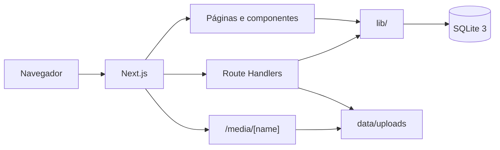
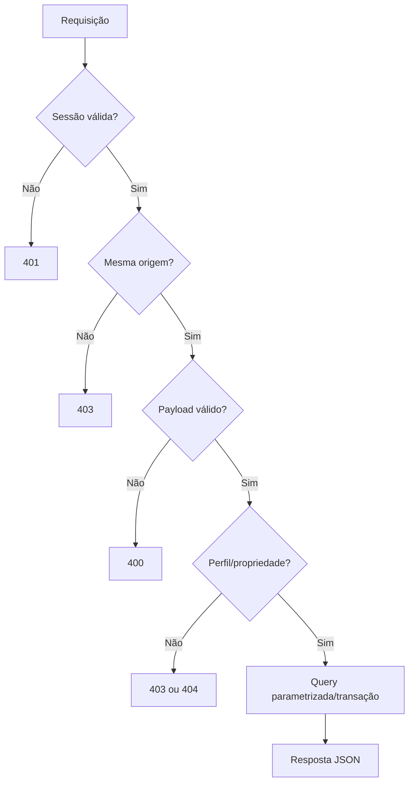
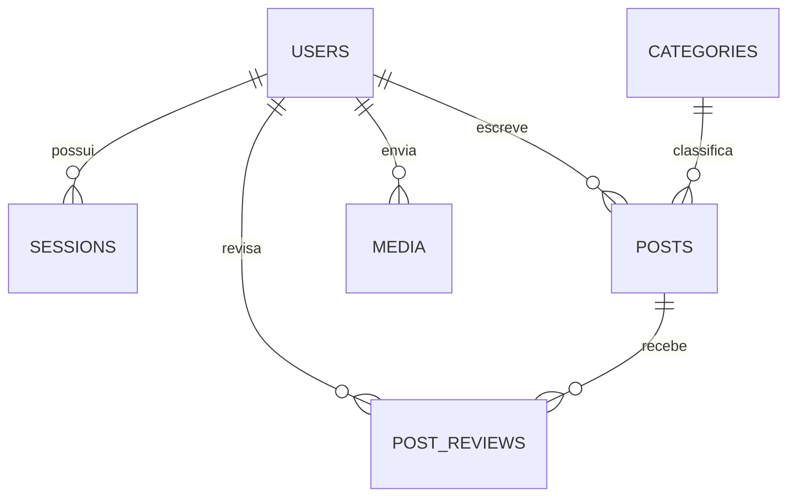
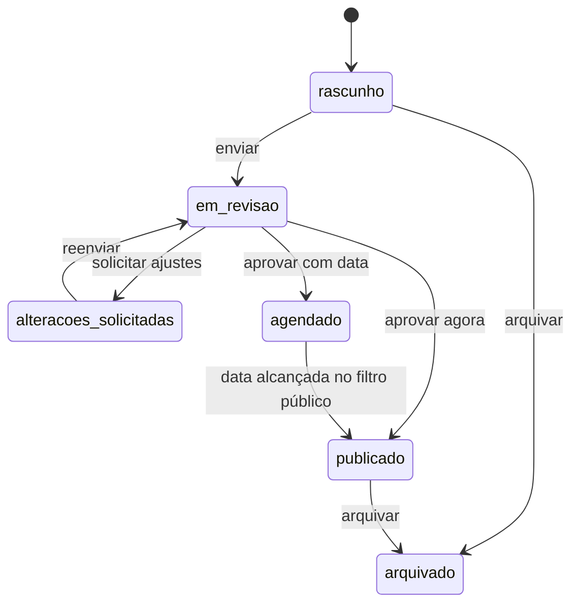
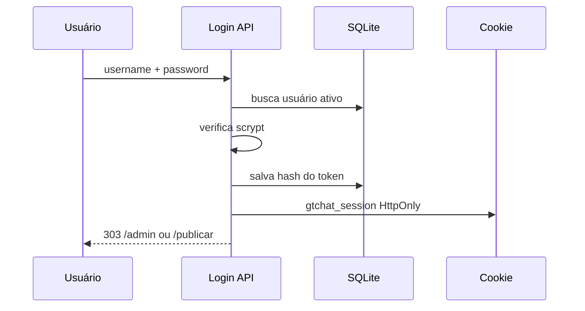

# Arquitetura do GTChat Blog

## 1. Resumo executivo

O GTChat Blog é uma aplicação monolítica modular construída com Next.js App Router. O mesmo processo entrega:

- páginas públicas renderizadas no servidor;
- interfaces autenticadas;
- endpoints internos;
- autenticação por sessão;
- acesso síncrono ao SQLite;
- arquivos de mídia armazenados em volume persistente.

A arquitetura foi planejada para **uma instância de aplicação**. SQLite simplifica operação e backup, mas não deve ser compartilhado por várias réplicas sem coordenação externa.



## 2. Organização de pastas

```text
app/
├── layout.tsx                  # HTML raiz, metadata e tokens do tema
├── page.tsx                    # Home pública por blocos
├── globals.css                 # Base visual
├── responsive.css              # Drawers e adaptação por viewport
├── artigos/
│   ├── page.tsx                # Busca e categorias
│   └── [slug]/page.tsx         # Artigo público e metadata
├── entrar/page.tsx             # Login
├── publicar/                   # Área do redator e editor
├── admin/                      # Administração protegida
├── api/                        # Endpoints JSON/form-data
├── media/[name]/route.ts       # Entrega de uploads
├── rss.xml/route.ts            # Feed RSS
├── robots.ts
└── sitemap.ts

components/                     # Componentes compartilhados
lib/
├── auth.ts                     # Sessão e guards
├── content.ts                  # Sanitização
├── db.ts                       # Conexão e consultas comuns
├── request.ts                  # Proteção de origem
├── security.ts                 # Senhas, tokens e slug
└── theme.ts                    # Padrões centrais do tema

db/schema.ts                    # Schema Drizzle
drizzle/0000_initial.sql        # Migration inicial
scripts/                        # Operação local e seed
data/                           # Persistência não versionada
Documentação/                   # Referência técnica
```

## 3. Camadas da aplicação

### 3.1 Apresentação

Local: `app/**/page.tsx`, `components/`, CSS.

Responsabilidades:

- renderizar HTML semântico;
- receber dados já autorizados;
- iniciar mutações pelos endpoints;
- responder a viewport, teclado e toque;
- mostrar estados de erro, vazio, salvamento e revisão.

### 3.2 Aplicação e regras

Local: Route Handlers e módulos em `lib/`.

Responsabilidades:

- validar sessão e perfil;
- verificar propriedade do artigo;
- validar payload;
- aplicar transições editoriais;
- sanitizar conteúdo;
- gerar slug;
- registrar auditoria.

### 3.3 Persistência

Local: `lib/db.ts`, `db/schema.ts`, `drizzle/`, `data/`.

Responsabilidades:

- conexão SQLite única por processo;
- WAL e chaves estrangeiras;
- queries parametrizadas;
- migrations versionadas;
- persistência do banco e uploads fora do código.

## 4. Estrutura front-end

### Server Components

São o padrão. Consultam SQLite e validam acesso antes de renderizar.

Exemplos:

- `SiteHeader` lê sessão e configurações;
- `HomePage` lê blocos, posts e categorias;
- páginas administrativas chamam `requireUser("admin")`;
- páginas de edição verificam autor antes de passar dados ao cliente.

### Client Components

Usados onde há interação persistente ou API do navegador:

- `PostEditor` — Tiptap, autosave, upload e ações;
- `ThemeEditor` — formulário, dirty state e prévia;
- `UserManager` — criação e atualização de usuários;
- menus móveis — foco, Escape e scroll lock;
- `ReviewActions` — mutações de revisão.

### CSS

- `globals.css`: tokens, layout público, painel e editor.
- `responsive.css`: drawers, editor de aparência e correções por breakpoint.
- tokens configuráveis são aplicados como CSS Custom Properties no `<html>`.

## 5. Estrutura back-end

O back-end usa Route Handlers em `app/api/`.

Padrão de mutação:



### Módulos comuns

| Módulo | Responsabilidade |
|---|---|
| `lib/auth.ts` | recuperar sessão e aplicar guards |
| `lib/security.ts` | scrypt, token SHA-256 e slugify |
| `lib/request.ts` | validar mesma origem |
| `lib/content.ts` | lista permitida de HTML |
| `lib/db.ts` | conexão, tipos e consultas públicas |
| `lib/theme.ts` | defaults compartilhados pelo seed e editor |

## 6. Banco de dados

### Tabelas

| Tabela | Finalidade |
|---|---|
| `users` | administradores e redatores |
| `sessions` | hashes de sessão e expiração |
| `categories` | taxonomia principal |
| `posts` | conteúdo, SEO e estado editorial |
| `post_reviews` | aprovações e pedidos de alteração |
| `media` | metadados dos uploads |
| `site_settings` | configurações chave/valor |
| `home_blocks` | blocos predefinidos da home |
| `audit_log` | ações relevantes |

### Relacionamentos



### Estados de artigo



O registro agendado continua com status `agendado`; a camada pública o considera visível quando `scheduled_at <= datetime('now')`.

## 7. Fluxo de autenticação

1. Usuário envia formulário para `POST /api/auth/login`.
2. Endpoint valida mesma origem e limitação por tentativas.
3. Usuário ativo é localizado pelo username.
4. Senha é verificada por scrypt com salt.
5. Token aleatório de 32 bytes é criado.
6. Somente SHA-256 do token é salvo em `sessions`.
7. Token original vai para cookie `HttpOnly`.
8. `getCurrentUser()` transforma cookie em hash e consulta sessão + usuário.
9. `requireUser()` protege páginas; `apiUser()` protege endpoints.
10. Logout remove sessão e cookie.



### Permissões

| Ação | Visitante | Redator | Admin |
|---|:---:|:---:|:---:|
| Ler artigo público | ✓ | ✓ | ✓ |
| Editar próprio rascunho | — | ✓ | ✓ |
| Editar artigo alheio | — | — | ✓ |
| Enviar para revisão | — | ✓ | ✓ |
| Aprovar/publicar/agendar | — | — | ✓ |
| Gerenciar usuários/tema | — | — | ✓ |

## 8. Fluxo de dados do artigo

1. Página server busca categorias e artigo autorizado.
2. `PostEditor` inicia Tiptap com HTML salvo.
3. Alterações atualizam estado e indicador de autosave.
4. Após 1,8 s, o cliente envia JSON/HTML ao endpoint.
5. Endpoint valida Zod, propriedade e estado.
6. HTML passa por `sanitizePostHtml()`.
7. JSON estruturado e HTML sanitizado são persistidos.
8. Redator envia para revisão.
9. Administrador aprova, agenda ou solicita alterações.
10. Consultas públicas filtram somente conteúdo disponível.

Na página `/artigos/[slug]`, a consulta `relatedPublicPosts()` busca até três artigos públicos, exclui o artigo aberto, prioriza a mesma categoria e completa posições restantes pela data de publicação. `publicCategorySummaries()` agrega todas as categorias com a quantidade de posts públicos, inclusive categorias ainda vazias, e `publicPostCount()` calcula o total geral. O resultado alimenta `RelatedPostsSidebar`, que reúne pesquisa, relacionados e categorias. Como os dados são lidos do SQLite durante a renderização dinâmica, categorias criadas ou excluídas no painel aparecem ou desaparecem automaticamente. O menu é lateral e fixo no desktop, passando para baixo do artigo em tablet e celular.

## 9. Fluxo do editor de aparência

1. Server Component carrega `getSettings()` e `getHomeBlocks()`.
2. `ThemeEditor` cria estado editável e cópia do último estado salvo.
3. A prévia usa CSS variables isoladas e blocos internos; não usa iframe.
4. Upload de logo/favicon passa por `/api/media`.
5. Restaurar padrão altera somente o formulário.
6. Publicar envia `settings` e `blocks` ao endpoint de tema.
7. Endpoint filtra chaves permitidas, atualiza em transação e registra auditoria.
8. `app/layout.tsx`, header, footer e home passam a refletir os valores persistidos.

## 10. Comunicação entre módulos

```text
Página server
  ├─ requireUser / getCurrentUser
  ├─ getSettings / getHomeBlocks / db.prepare
  └─ Componente cliente
       └─ fetch('/api/...')
            ├─ apiUser
            ├─ sameOrigin
            ├─ Zod
            ├─ regra de domínio
            └─ SQLite / uploads
```

Evite importar componentes clientes em módulos de banco ou segurança. A dependência deve apontar da interface para as regras, nunca o contrário.

## 11. Como adicionar uma nova página

### Página pública

```tsx
// app/sobre/page.tsx
import { SiteFooter } from "@/components/site-footer";
import { SiteHeader } from "@/components/site-header";

export const metadata = {
  title: "Sobre a GTChat",
  description: "Conheça a GTChat.",
};

export default function AboutPage() {
  return <>
    <SiteHeader />
    <main className="container section">...</main>
    <SiteFooter />
  </>;
}
```

Depois, avaliar sitemap e navegação.

### Página administrativa

```tsx
// app/admin/relatorios/page.tsx
import { AdminShell } from "@/components/admin-shell";
import { requireUser } from "@/lib/auth";

export default async function ReportsPage() {
  const user = await requireUser("admin");
  return <AdminShell user={user} title="Relatórios">
    <div className="app-content">...</div>
  </AdminShell>;
}
```

Adicionar o link tanto na sidebar quanto no `AdminMobileMenu`.

## 12. Como adicionar uma nova funcionalidade

1. Definir ator, caso de uso e estados.
2. Verificar se exige mudança de schema.
3. Se exigir, atualizar `db/schema.ts` e gerar migration incremental.
4. Implementar ou reutilizar regra em `lib/`.
5. Criar endpoint com autenticação, origem e Zod.
6. Criar Server Component para carregar dados.
7. Usar Client Component apenas para interação.
8. Aplicar o design system.
9. Adicionar testes e atualizar documentação.
10. Validar build, persistência e responsividade.

## 13. Migrations

- `db/schema.ts` é a representação declarativa.
- `drizzle/*.sql` é o histórico aplicado.
- Nunca editar uma migration já usada em produção para mudar o passado.
- Criar uma nova migration incremental.
- Migrations devem ser seguras para dados existentes.
- Backups de banco e uploads precedem alterações estruturais em produção.

## 14. Uploads e mídia

- Metadados: tabela `media`.
- Arquivos: `UPLOADS_DIR` ou `data/uploads`.
- Nome original não controla o caminho final.
- Nome persistido é gerado com timestamp + bytes aleatórios.
- A rota pública verifica formato do nome e existência no banco.
- Cache público é imutável porque cada upload recebe nome único.

## 15. SEO e conteúdo público

- Metadata global vem de `site_settings`.
- Metadata de artigo usa campos SEO com fallback.
- `APP_URL` define URLs absolutas de sitemap, RSS e metadata.
- `robots.ts`, `sitemap.ts` e RSS usam apenas conteúdo público.
- HTML público vem do conteúdo sanitizado no servidor.

## 16. Execução e implantação

### Local

```bash
npm install
npm run db:migrate
npm run db:seed
npm run dev
```

### Produção Linux

```text
Internet → Caddy/Nginx (HTTPS) → Next.js :3000 → SQLite + uploads em /app/data
```

O Dockerfile gera saída standalone, executa como usuário não-root e monta `/app/data` como volume.

Variáveis relevantes:

| Variável | Finalidade |
|---|---|
| `APP_URL` | URL pública canônica |
| `DATABASE_PATH` | caminho do SQLite |
| `NEWSLETTER_DATABASE_PATH` | caminho do SQLite separado da lista de e-mails |
| `UPLOADS_DIR` | pasta de uploads |
| `MAX_UPLOAD_MB` | limite de upload |
| `BOOTSTRAP_ADMIN_*` | criação inicial temporária |

## 17. Como evitar dependências desnecessárias

Antes de instalar um pacote:

1. Verificar se Next.js, React, Node ou CSS já resolvem.
2. Verificar se uma dependência atual já oferece a função.
3. Comparar tamanho, manutenção, licença e compatibilidade server/client.
4. Evitar bibliotecas para funções pequenas como slug, debounce ou modal simples.
5. Não adicionar um segundo ORM, editor, biblioteca de ícones ou sistema de estilos.
6. Documentar a razão quando a dependência for realmente necessária.

## 18. Limitações conhecidas e evolução segura

- A limitação de login usa memória do processo; reinício limpa contadores e várias instâncias não compartilham estado.
- SQLite pressupõe uma instância de escrita.
- A listagem pública busca até 60 artigos e ainda não possui paginação real.
- Tags são texto separado por vírgula, apesar de o plano inicial prever tabelas normalizadas.
- Não existe histórico completo de versões do conteúdo.
- Métricas são operacionais, não analytics avançado.

Evoluções devem preservar compatibilidade e ser acompanhadas de migration, testes e documentação.

## 18.1 Construtor visual da página inicial

O editor de aparência é um construtor de seções controlado, inspirado no fluxo de uma grade visual:

1. `HOME_BLOCK_LIBRARY` define os tipos permitidos e seus valores iniciais.
2. `ThemeEditor` adiciona, duplica, reordena, oculta, configura e exclui instâncias.
3. A prévia usa o estado local, sem publicar automaticamente.
4. `PUT /api/admin/theme` valida tipo, ID e configuração de cada bloco.
5. A transação atualiza, cria e remove registros de `home_blocks`.
6. A home pública lê os blocos ativos na ordem persistida.

Tipos atuais: `hero`, `latest`, `text` e `cta`. A antiga seção de categorias não é renderizada. CSS e JavaScript arbitrários continuam proibidos.

## 18.2 Fluxo de categorias

`CategoryManager` chama endpoints administrativos. Ao excluir uma categoria, uma transação define `posts.category_id` como `NULL` antes de remover a categoria, preservando todos os artigos. O editor de artigos atualiza a listagem após cada mutação.

## 18.3 Arquitetura do construtor de páginas

O documento versionado segue `Página → Seções → Colunas → Elementos`.

- `lib/page-builder.ts`: contratos, validação, biblioteca e modelos.
- `components/page-builder-editor.tsx`: canvas, histórico, autosave e propriedades.
- `components/page-renderer.tsx`: renderização comum à prévia e ao site público.
- `/admin/paginas`: gerenciamento.
- `/admin/paginas/[id]/editor`: construção visual.
- `/[slug]`: publicação institucional.
- `/`: usa a página marcada como inicial, com fallback legado.

`draft_json` e `published_json` são separados. Autosave nunca altera o conteúdo público; somente publicar atualiza `published_json`.

O arrastar e soltar trabalha sobre IDs de seção, coluna e elemento. A biblioteca cria um novo elemento no destino; elementos já existentes são removidos da origem e inseridos na posição indicada dentro da mesma atualização imutável do documento. Colunas vazias continuam sendo destinos válidos. O histórico recebe a operação completa, permitindo desfazer e refazer sem estados intermediários.

O canvas fornece ações contextuais por seção. Todas chamam as mesmas operações imutáveis usadas pelo painel de camadas, portanto inserção intermediária, duplicação, exclusão e reordenação permanecem compatíveis com histórico e autosave. Propriedades de seção como `background`, `color`, `gap`, `minHeight` e `verticalAlign` pertencem ao documento e passam pela validação do schema antes de serem persistidas.

Listas com dois campos, como benefícios e perguntas frequentes, continuam compactas no JSON (`título|descrição`). A função `parsePairedItem` centraliza a leitura e mantém compatibilidade com itens antigos que tinham apenas título.

| Tabela | Responsabilidade |
|---|---|
| `pages` | Metadados, SEO, rascunho e publicação |
| `page_sections` | Índice das seções por posição |
| `page_versions` | Histórico restaurável |
| `reusable_sections` | Modelos do administrador |
| `page_templates` | Modelos persistidos/importados futuros |

As migrations são executadas em ordem lexical. O construtor não aceita HTML, CSS ou JavaScript arbitrário; tipos, URLs, cores, profundidade e tamanho são validados.

## 18.4 Lista de e-mails

A newsletter usa `NEWSLETTER_DATABASE_PATH` e o arquivo padrão `data/newsletter.sqlite`. `lib/newsletter-db.ts` abre esse banco em WAL e executa, em ordem lexical, as migrations de `newsletter-drizzle/`. O volume `/app/data` preserva os dois bancos no Linux.

Fluxo público:

1. `NewsletterSignup` coleta nome opcional, e-mail e consentimento explícito.
2. `POST /api/newsletter/subscribe` valida origem, limite, honeypot e payload.
3. O e-mail é normalizado e gravado sem duplicidade.
4. Um cadastro inativo é reativado e recebe nova data e versão de consentimento.
5. O endpoint sempre usa uma mensagem de sucesso genérica para não enumerar contatos.

O painel `/admin/inscritos` e seus endpoints exigem administrador. A exportação lê somente registros `active` e gera CSV UTF-8 protegido contra fórmulas. Não há envio de e-mail nem CRM nesta versão; uma integração futura deverá consumir o banco separado e respeitar os registros inativos.

## 19. Leitura complementar

- [API.md](./API.md)
- [COMPONENTS.md](./COMPONENTS.md)
- [DESIGN-SYSTEM.md](./DESIGN-SYSTEM.md)
- [RULES.md](./RULES.md)
- [CLAUDE.md](./CLAUDE.md)
